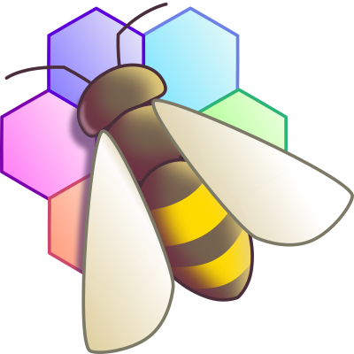

# Neue Sektion für Tools
Es gibt eine neue Sektion unter Info/Links für Tools.
Hier finden zukünftig Tools, die hilfreich für die Spieleentwicklung sind, ihren Platz.

## Beeref
{ .px100 .left } Der Anfang macht ein Tool mit dem Namen "BeeRef", bei dem Referenz-Fotos gesammelt und angezeigt werden können.
Auch die Option das Fenster immer im Vordergrund anzuzeigen, ist sehr Hilfreich

## Material Maker
{ .px100 .left } Des weiteren ist jetzt auch der Material Maker present in unseren Tools.

Damit können Materialien/Texturen auf einfache Weise erstellt werden, und bereits erstellte Materialien, können in euren Projekten frei verwendet werden. (Lizenz beachten!)

Weitere Info unter [links/tools](/homepage/info/links/tools.html)
