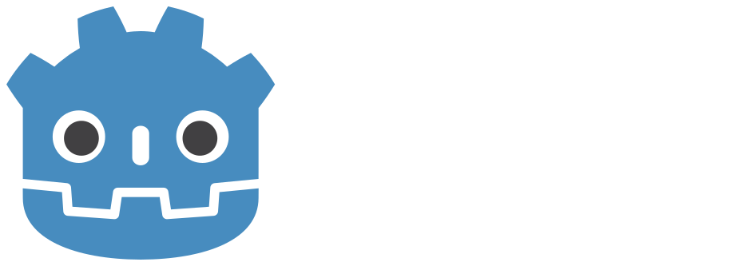
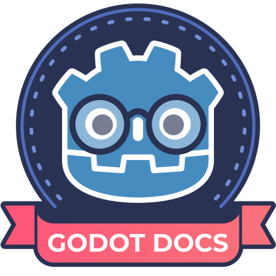

# Godot

## Godot-Engine
{ .px150 .left }
Die offizielle englischsprachige Homepage der Godot-Engine. Hier findet ihr die neuesten News, Änderungen, Downloads und Ankündigungen. Sowie ein Forum, Fragen&Antworten und eine Übersicht über die Communitys und Informationsquellen.

[Godot-Engine](https://godotengine.org/){ target="godot" }

## Godot Docs
{ .px150 .left }
Die Dokumentation- und Hilfe-Seiten zu der Godot-Engine. Dort befindet sich die aktuelle Beschreibung der API, aller Befehle, sowie Vorschläge für bestimmte Vorgehensweisen bei der Entwicklung.
Es sind leider noch nicht alle Seiten auf deutsch übersetzt, und wer Lust hat, kann sich dort auch an der Übersetzung der Dokumentation beteiligen.

[Godot Dokumentation](https://docs.godotengine.org/de/stable/){ target="docu" }

## Godot Shaders
{ .px150 .left }
Eine Webseite mit Shaders für die Godot-Engine, und auch Informationen und Hilfen für das Schreiben von Shaders in der Godot-Engine.

[godotshaders.com](https://godotshaders.com/){ target="godot" }

## GDScript
{ .px150 .left }
Eine Webseite über die beliebte Skriptsprache GDScript. Mit Tutorials, und Lösungsvorschlägen, wie bestimmte Herangehensweisen gelöst werden können. Und allgemeine Information zu der Skriptsprache.

[gdscript.com](https://gdscript.com/){ target="gdscript" }
